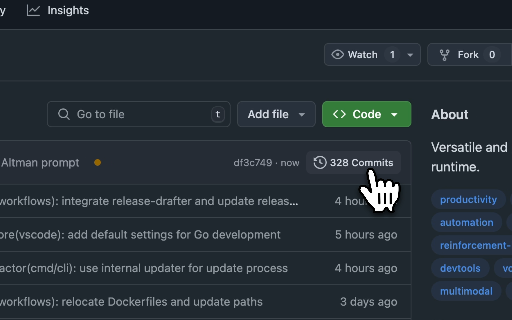

# Nomi - Versatile and Privacy-Focused AI Runtime

*Nomi aim to bridges the gap to intelligence, making it easy for everyone to harness AI and technologies. It can automates time-consuming tasks and adapts to your unique needs, putting control and ownership of data back in your hands.*

> **Note:** This project is under active development and isn't ready for full use yet. We're working hard to make it stable and reliable.
>
> We welcome any feedback, suggestions, or contributions. Thank you for trying Nomi!

[](https://youtu.be/052_iPYg22w?si=uHjvmAl_zuEvpi5o)

- [Introduction](#introduction)
  - [Features](#features)
  - [Why Nomi?](#why-nomi)
  - [Use Cases](#use-cases)
- [Get Started](#get-started)
  - [Linux & MacOS](#linux--macos)
  - [Windows](#windows)
  - [Compile from Source](#compile-from-source)
- [Enable Providers](#enable-providers)
  - [Ollama](#ollama)
  - [OpenAI](#openai)
  - [OpenRouter](#openrouter)
- [Roadmap](#roadmap)
- [License](#license)
- [Aknowledgments](#acknowledgments)

### Features

- **Versatile AI Runtime:** Lightweight and highly configurable for seamless integration.
- **Privacy-Focused:** Maintains local archives of your data, ensuring you stay in control.
- **Multi-Modal Interface:** Accepts text and voice inputs (image support coming soon).
- **Provider Integration:** Connects with AI services like OpenAI, OpenRouter, and Ollama.
- **Conversation Management:** Create, load, and organize conversations.
- **Prompt Engineering:** Add, edit, and manage system prompts.
- **Code Interpreter:** Run code on the fly within Nomi.
- **Voice Interaction:** Enable real-time voice interactions.
- **Terminal Experience:** Enjoy markdown-formatted output and easy command-line usage.

Explore additional features and use cases in the [Roadmap](#roadmap) section.

### Why Nomi?

In a world where data ownership is challenging and AI is changing how we communicate, Nomi acts as a bridge between your private data and AI capabilities. It supports both local and external providers, including OpenAI, OpenRouter, and Ollama.

While external providers involve sending data externally, Nomi also works with local providers like Ollama, ensuring you retain control over your data. Our aim is to democratize AI by making it more accessible and user-friendly for everyone.

**Looking Ahead**

We're building the Nomi runtime quickly, but our journey doesn't stop there. Soon, we'll expand Nomi into a full AI platform designed to bridge the gap for non-technical users. Our goal is to make advanced AI accessible and easy to use for everyone, enabling you to benefit from AI without the need for technical expertise.

### Use Cases

- **Personal AI Assistant**
- **Voice-Controlled AI Interaction**
- **Workflows and Automation**
- **Privacy-Focused Data Analysis**

And many more! With Nomi's flexible and extensible architecture, you can create your own use cases.

List your installed use cases using the `nomi usecases list` or `nomi u list` command.

- [Auto Commit Message](https://github.com/nullswan/nomi/tree/main/usecases/commit)
- [Browser Automation](https://github.com/nullswan/nomi/tree/main/usecases/browser)
- [Copywriting & Brainstorming Assistant](https://github.com/nullswan/nomi/tree/main/usecases/copywriter)
- **Software Architecture Assistant** — *Coming soon!*

## Get Started

### Supported Platforms

- **Linux**: x86_64, ARM64, i686
- **MacOS**: ARM64
- **Windows**: x86_64, i686

### Linux & MacOS

```shell
curl -sSL https://raw.githubusercontent.com/nullswan/nomi/refs/heads/main/install.sh | bash
```

### Windows

> **Note:** Windows support is experimental. Please report any issues you encounter.

```shell
curl -sSL https://raw.githubusercontent.com/nullswan/nomi/refs/heads/main/install.bat | cmd
```

### Compile from Source

```shell
git clone https://github.com/nullswan/nomi.git
cd nomi
./hack/install-deps.sh
make build
```

## Enable Providers

We recommend using Ollama is you are concerned about privacy. OpenAI if you are not concerned about privacy and pricing but rather want high performance and have decent internet connection. OpenRouter if you want to switch between providers easily and maintain an efficiency balance.

### Ollama

You can install Ollama from [https://ollama.com/download](https://ollama.com/download) or it will be automatically installed with Nomi.

For now, we support text LLM through Ollama. Voice and other features are coming soon.

### OpenAI

Every feature supports OpenAI. You can enable it by setting the `OPENAI_API_KEY` environment variable and launch Nomi.

You can create an API key from the [OpenAI dashboard](https://platform.openai.com/api-keys).

```shell
export OPENAI_API_KEY="your-api-key"
```

### OpenRouter

OpenRouter is a multi provider API. We recommend using it for ease of provider switching.

For now, we support text LLM through OpenRouter. Voice and other features are coming soon.

You can enable it by setting the `OPENROUTER_API_KEY` environment variable and launch Nomi.

You can create an API key from the [OpenRouter dashboard](https://openrouter.ai/settings/keys).

```shell
export OPENROUTER_API_KEY="your-api-key"
```

## Roadmap

These features are planned for future updates. They may be partially or not implemented yet.

- **Full AI Platform Development**
  - User-friendly GUI
  - Intuitive interfaces for non-technical users
  - Expanded use case library
- **CLI Enhancements**
  - Auto-update (Update command is already available)
  - Editor mode
  - Sound on completion
- **Engine Improvements**
  - Metrics tracking
  - Daemon mode
  - HTTP Interface
  - Scheduled tasks
- **Provider Support**
  - Local Whisper
  - Vision Support
  - Anthropic Support
  - Text-to-Speech (TTS)
  - Easy transcription command
  - Transcript memory
- **Actions**
  - Presets/Projects
  - Memory tools for scripted decisions
  - Memory tools for general decisions
- **Conversation Features**
  - Markdown backup
  - New conversation types
- **Memory Enhancements**
  - Integrations
  - Use of embeddings API
- **Interpreter Updates**
  - Ask for feedback
  - Machine safety
- **File Management**
  - Real-time file management

## License

This project is licensed under the MIT License.

> See the [LICENSE](LICENSE) file for details. We believe in the power and fairness of open-source software.

## Acknowledgments

Thank you to all the libraries and tools used in this project:

- [Bubbletea](https://github.com/charmbracelet/bubbletea)
- [Ollama](https://github.com/ollama/ollama)
- [SQLite/SQLC](https://modernc.org/sqlite), [Golang-Migrate](https://github.com/golang-migrate/migrate/)
- [PortAudio](https://github.com/gordonklaus/portaudio)
- [go-openai](https://github.com/sashabaranov/go-openai)
- [Gohook](https://github.com/robotn/gohook)
- [Cobra](https://github.com/spf13/cobra)

Big thanks to the open-source community and every maintainers for making this project possible.
